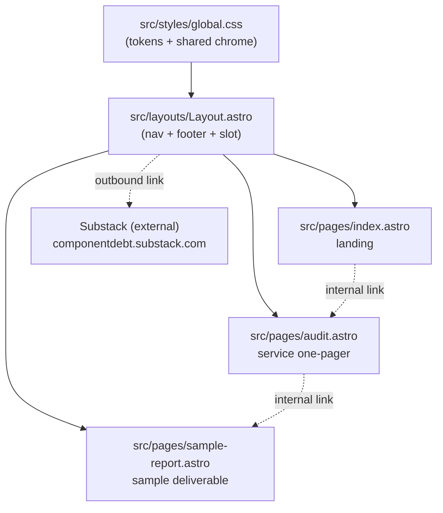

# feat: Scaffold Component Debt Astro marketing site (v1, four pages)

## Summary

Stand up the public marketing site for Component Debt as a greenfield Astro project, ported
from three finished HTML source files that already share one WCAG AA-verified token palette.
v1 is four destinations on a single shared layout: a landing page, a service one-pager, a
sample audit report, and an outbound Substack link in the nav and footer. The token palette
and the accessibility decisions (teal gradients chosen so white text clears 4.5:1, severity
encoded by shape and text as well as color) are carried over verbatim, not re-derived.

The site must build clean (`npm run build`), ship near-zero JavaScript, and pass the project's
non-negotiables before any commit: no em-dashes anywhere, no banned words, no fintech or
wealthtech marketing, AA contrast computed not eyeballed, and no state conveyed by color alone.

---

## Problem Frame

The repo is empty except for `.git` and `CLAUDE.md`. Component Debt has no public web presence,
only three standalone HTML mockups living outside the repo in `~/Claude/Projects/DS Audit/`.
Those files are design-complete and accessibility-verified but are single-file artifacts: they
duplicate the same `:root` token block three times, hard-code the nav-less layout, and cannot
be deployed or maintained as a real site. The work is to turn them into a maintainable Astro
site with a shared layout and a single source of truth for tokens, while preserving the design
and copy intent the source files already settled.

This is a scaffold-and-port task, not a design task. The product decisions (offer ladder,
pricing, four-pillar pitch, async-first positioning) are already made in the brief and the
source assets. The plan's job is faithful translation plus the engineering structure the
mockups lack.

---

## Requirements

Carried from the build brief (`origin`) and the project `CLAUDE.md`.

- **R1.** Astro (latest stable), TypeScript, plain CSS with custom properties, no CSS framework. Node 20+.
- **R2.** A single shared `Layout.astro` carrying nav and footer; the header must not be duplicated per page.
- **R3.** The token palette from `launchpad.html` is defined once as CSS custom properties and reused everywhere. Colors are not silently changed; any change re-checks contrast.
- **R4.** Landing page (`/`): hero, four-pillar pitch (token architecture, component API consistency, accessibility, documentation), the $2,500 fixed-scope audit offer, and an async-first CTA (email or form, not calendar-heavy).
- **R5.** Service one-pager (`/audit`): what you get, scope, deliverables (written report, recorded walkthrough, 30-minute Q&A), one-week async timeline, the $6k-$15k remediation upsell.
- **R6.** Sample audit report (`/sample-report`): the full example deliverable as proof of quality, including the severity legend encoded by shape and text plus color.
- **R7.** Substack link (`componentdebt.substack.com`) present in nav and footer; posts are not rehosted. External link opens appropriately.
- **R8.** `npm run build` is green before any commit.
- **R9.** Accessibility floor on every page: semantic HTML, real visible focus states, keyboard-navigable, alt text on every image, AA contrast (4.5:1 normal text, 3:1 large/UI) computed mathematically, never state by color alone.
- **R10.** Prose constraints on all visible copy: no em-dashes, none of the banned words (delve, leverage as verb, robust, seamless, game-changer, unlock as metaphor, dive into, it's worth noting, in today's fast-paced world, at the end of the day, genuinely, straightforward), no emojis, full forms in formal copy.
- **R11.** No fintech or wealthtech marketing in any copy (InvestCloud Section 8.6). Claims defensible against what the audit actually delivers.

**Success criteria:** the four destinations render with the ported design, the build is green, and an automated contrast/prose check over the built output passes the non-negotiables.

---

## Key Technical Decisions

- **Astro `minimal` TypeScript starter, not a themed template.** The brief specifies an empty/minimal template; a themed starter would import CSS and components we immediately delete. Scaffold minimal, then add our own `src/layouts`, `src/pages`, and `src/styles`. *(see origin: build order step 1)*
- **One global stylesheet for tokens and shared primitives, imported by the layout.** The three source files each repeat the same `:root` block and a near-identical set of card/hero/section rules. Consolidate the token block plus the shared chrome (hero gradient, `.card`, headings, `.cta`, severity badges) into a single `src/styles/global.css` imported once in `Layout.astro`. Page-specific CSS (offer grid, findings list, roadmap table) lives in component-scoped `<style>` blocks or a small per-page stylesheet. This is the single-source-of-truth requirement (R3) made concrete.
- **Plain CSS custom properties, no preprocessor, no framework.** Matches the brief and the source assets exactly; the palette is already a flat set of custom properties. Adding Sass or Tailwind would be unjustified surface area for a four-page site.
- **Pages are `.astro` files, near-zero JS.** None of the four pages needs client-side interactivity for v1. The launchpad's checklist/localStorage script is an internal-tool feature that does not belong on the public marketing site; it is dropped, not ported. The "Copy" buttons on outreach templates are also internal-tool features and are not part of v1's four public pages.
- **CTA defaults to a `mailto:` link plus a clearly-marked hosted-form placeholder.** Per the confirmed scope call-out, the working primary CTA is a real `mailto:` so the site is shippable today; a second, visibly-marked link stands in for a Tally/Google Forms intake URL that Andrew swaps in later. No form provider dependency is introduced. *(confirmed with user; brief lists contact mechanism as Andrew's action item)*
- **Nav and footer live only in `Layout.astro`.** Both carry the Substack outbound link (R7). Active-page indication uses text/`aria-current`, not color alone (R9).
- **Severity encoding is preserved exactly from the sample report.** Triangle = high, diamond = medium, circle = low, each paired with a text label and an AA-contrast color. This is the brand's whole point; it is ported verbatim and verified, not redesigned. *(see origin: sample-audit-report.html severity legend)*

---

## High-Level Technical Design

The site is a thin file-based routing tree over one shared layout and one global stylesheet.
The diagram shows the composition: every page imports the same layout, which imports the same
tokens; page-specific styling stays local to each page.



The token layer is the contract: change `--accent` in one place and the hero, badges, CTA, and
links all move together, with contrast checked once at the token level rather than per-page.

---

## Output Structure

Expected layout after the scaffold and port. The Astro starter generates the config and
`package.json`; the rest is our work. The per-unit `**Files:**` sections remain authoritative.

```text
component-debt-site/
  astro.config.mjs
  package.json
  tsconfig.json
  public/
    favicon.svg
  src/
    layouts/
      Layout.astro          # nav, footer, <head>, imports global.css
    pages/
      index.astro           # landing (/)
      audit.astro           # service one-pager (/audit)
      sample-report.astro   # sample deliverable (/sample-report)
    styles/
      global.css            # token palette + shared chrome (hero, card, cta, badges)
  CLAUDE.md                 # already present
  docs/plans/               # this plan
```

---

## Implementation Units

### U1. Scaffold the Astro project

**Goal:** A clean, minimal Astro + TypeScript project that builds, with the starter's
placeholder content removed so later units add real pages onto a bare frame.

**Requirements:** R1, R8.

**Dependencies:** none.

**Files:**
- `astro.config.mjs` (generated, then reviewed)
- `package.json` (generated)
- `tsconfig.json` (generated)
- `public/favicon.svg`
- delete any starter `src/pages/index.astro` placeholder and starter components/styles

**Approach:** Run the minimal TypeScript starter in the existing repo (the directory already
holds `.git` and `CLAUDE.md`, so scaffold in place rather than into a subfolder). Confirm Node
20+ is satisfied. Remove starter demo content so U2 builds the layout on a clean tree. Do not
add any dependency beyond what the minimal starter ships.

**Patterns to follow:** Astro's documented minimal project structure (`src/pages`, `src/layouts`, `src/components`, `public/`).

**Test scenarios:**
- `Test expectation: none -- scaffolding unit; behavior is verified by U8's build gate.` The only check here is that `npm install` and `npm run build` succeed on the bare project; no application behavior exists yet.

**Verification:** `npm run build` exits 0 on the scaffolded project; the starter's demo page no longer appears in `dist/`.

---

### U2. Build the shared layout and token stylesheet

**Goal:** One `Layout.astro` providing `<head>`, nav, footer, and a content slot, plus one
`global.css` holding the ported token palette and shared chrome. This is the spine every page
mounts on.

**Requirements:** R2, R3, R7, R9, R10, R11.

**Dependencies:** U1.

**Files:**
- `src/layouts/Layout.astro`
- `src/styles/global.css`

**Approach:** Port the `:root` custom-property block verbatim from `launchpad.html` /
`service-one-pager.html` (the palettes match; the report adds severity tokens, included here so
all pages share one source). Define shared chrome once: body typography, the teal hero gradient
(`linear-gradient(135deg,#123540,#17576b)`), `.card`/`section`, heading scale, `.cta`, link
color, and the severity badge classes (`.sev.crit/.med/.low` with their shape `::before`
glyphs). Build a semantic `<header><nav>` with links to `/`, `/audit`, `/sample-report`, and an
outbound Substack link, plus a `<footer>` repeating the Substack link and the non-fintech
positioning line. Active page uses `aria-current="page"` and a non-color cue (weight or
underline), never color alone. Add a real `:focus-visible` style. The layout takes a `title`
prop for per-page `<title>`.

**Technical design (directional, not specification):** `Layout.astro` exposes `interface Props { title: string }`, renders `<slot />` between header and footer, and imports `global.css` at the top of its frontmatter so every consuming page inherits tokens.

**Patterns to follow:** the hero gradient, `.card`, `.cta`, and `.sev` rules in
`sample-audit-report.html` and `service-one-pager.html`; keep their exact color values.

**Test scenarios:**
- Layout renders nav with all three internal routes plus the Substack outbound link, and footer repeats the Substack link.
- Outbound Substack link points to `https://componentdebt.substack.com` and carries `rel="noopener"` (and `target="_blank"` if opening in a new tab).
- Active-route indication is present via `aria-current` and a non-color cue, not color alone (R9, accessibility-critical).
- `:focus-visible` produces a visible outline on nav links under keyboard focus.
- Token custom properties resolve (e.g., `--accent`, `--accent2`, severity tokens) and the hero gradient renders.
- Prose check: nav, footer, and any layout copy contain no em-dash and no banned word (R10).

**Verification:** `npm run build` is green; the rendered layout shows nav and footer on a
throwaway test page; keyboard tab order reaches every nav link with a visible focus ring.

---

### U3. Build the landing page (`/`)

**Goal:** The public landing page: hero, four-pillar pitch, the $2,500 audit offer with the
remediation upsell, and the async-first CTA. This is the explicit review checkpoint before the
remaining pages.

**Requirements:** R4, R8, R9, R10, R11.

**Dependencies:** U2.

**Files:**
- `src/pages/index.astro`
- (optional) `src/styles/landing.css` or a scoped `<style>` block for the offer grid

**Approach:** Compose the page inside `Layout`. Reframe the launchpad's internal positioning
into public, second-person marketing copy: the one-sentence positioning becomes the hero; the
four pillars (token architecture, component API consistency, accessibility, documentation)
become the pitch section; the offer ladder becomes the two-tier offer box (audit featured,
remediation as next step), using the same `.offer`/`.tier` treatment from `launchpad.html`. The
CTA is a `mailto:` primary action plus a marked hosted-form placeholder link (per KTD). Drop the
launchpad's checklist, outreach templates, localStorage script, and the internal "Guardrails /
InvestCloud" section entirely; those are internal-tool content, not public copy. Do not imply
fintech clients.

**Patterns to follow:** `.offer`, `.tier`, `.tier.featured`, `.tag`, `.pill` from `launchpad.html`; hero treatment from `service-one-pager.html`.

**Test scenarios:**
- Hero renders the positioning statement and the async-first qualifier; the four-pillar pitch lists exactly token architecture, component API consistency, accessibility, documentation (R4).
- Offer box shows the $2,500 fixed-scope audit as featured and the $6k-$15k remediation as the next step.
- Primary CTA is a working `mailto:` link; the hosted-form placeholder link is present and visibly marked as a placeholder.
- Internal link to `/audit` resolves.
- Edge case: the dropped internal sections (checklist, outreach templates, guardrails) do not appear in the rendered output.
- Accessibility: hero white-on-teal text and the CTA meet AA (verified in U8); any image has alt text; no state conveyed by color alone (R9).
- Prose check: no em-dash, no banned word, no emoji, no fintech/wealthtech implication (R10, R11).

**Verification:** `npm run build` green; `/` renders the four destinations of content above;
manual read confirms reframed (not copy-pasted-internal) copy; checkpoint review with Andrew
before U4-U5.

---

### U4. Build the service one-pager (`/audit`)

**Goal:** The service detail page: problem framing, who it is/isn't for, what you get,
how it works, investment, FAQ, and a closing CTA.

**Requirements:** R5, R8, R9, R10, R11.

**Dependencies:** U2 (independent of U3; ordered after the landing checkpoint).

**Files:**
- `src/pages/audit.astro`
- (optional) scoped `<style>` for the deliverables grid and process steps

**Approach:** Port `service-one-pager.html` into `Layout`, dropping its inlined `:root` and
shared chrome (now in `global.css`) and its standalone `<head>`. Keep the page-specific CSS:
the `.twocol` good-fit / not-a-fit grid, the `.deliv` deliverables grid, the numbered
`ol.steps` process, the `.pricebox`, and the FAQ. The "Not a fit" column already names
financial services / wealthtech as out of scope, which satisfies R11 and should be kept. Link
"See a sample report" to `/sample-report`. Replace the closing intake-form CTA with the same
`mailto:` + placeholder pattern as the landing page so the two pages stay consistent.

**Patterns to follow:** `.twocol`, `.deliv`, `ol.steps`, `.pricebox`, `.faq`, `.endcta` from `service-one-pager.html`.

**Test scenarios:**
- Page renders all six source sections: problem, who it's for, what you get, how it works, investment, FAQ.
- The "Not a fit" list retains financial services / wealthtech as explicitly out of scope (R11).
- Deliverables grid shows the four deliverables: written report, prioritized roadmap, recorded walkthrough, 30-minute Q&A (R5).
- "See a sample report" link resolves to `/sample-report`; closing CTA uses the `mailto:` + placeholder pattern.
- Process steps render in order with their numbered markers.
- Accessibility: numbered-step markers and any status cue are not color-only; AA contrast verified in U8.
- Prose check: no em-dash, no banned word, no emoji (R10).

**Verification:** `npm run build` green; `/audit` renders the full one-pager; cross-links to
landing and sample report work.

---

### U5. Build the sample audit report (`/sample-report`)

**Goal:** The full example deliverable: cover, executive summary with scorecard, method and
severity legend, ten findings, prioritized roadmap table, what's working, and next steps. This
page is the brand's accessibility proof, so the severity encoding must be exact.

**Requirements:** R6, R8, R9, R10, R11.

**Dependencies:** U2 (independent of U3/U4; ordered after the landing checkpoint).

**Files:**
- `src/pages/sample-report.astro`
- (optional) scoped `<style>` for findings, scorecard, and roadmap table

**Approach:** Port `sample-audit-report.html` into `Layout`, dropping its inlined tokens and
shared chrome and keeping page-specific CSS: the `.scores` scorecard, the `.finding` cards with
their left-border severity accent, the `.sev` badges (shape + label + color), the roadmap
`table`, and the `@media print` rules (worth keeping so the sample reads as a real deliverable).
Preserve the severity legend's explicit note that severity is shown by shape and label as well
as color. The sample client is fictional ("Northwind Health"); keep the footer disclaimer that
findings and client are illustrative. Verify the in-content example contrast claims (e.g., the
"2.6:1 fails AA" finding) are stated correctly, since this page markets the brand's accuracy.

**Patterns to follow:** `.finding.crit/.med/.low`, `.sev` shape glyphs, `.scores`, the roadmap `table`, and the `@media print` block from `sample-audit-report.html`.

**Test scenarios:**
- Severity badges render shape + text + color for all three levels: triangle/High, diamond/Medium, circle/Low (R6, R9 accessibility-critical, integration of CSS `::before` glyphs with badge text).
- Removing color (simulated grayscale) still distinguishes severities via shape and label (the core "never color alone" guarantee).
- Findings list renders all ten findings with their IDs and severity badges; the scorecard shows the four summary metrics.
- Roadmap table renders four phases with their addressed-findings and effort columns.
- The footer disclaimer marking the report as a fictional sample is present.
- Edge case: print stylesheet does not break screen rendering; cover gradient still prints (color-adjust exact).
- Content accuracy: the contrast figures cited in findings are internally consistent (a finding claiming "fails AA" cites a ratio below 4.5:1).
- Prose check: no em-dash, no banned word (R10).

**Verification:** `npm run build` green; `/sample-report` renders the full deliverable;
grayscale check confirms severity remains distinguishable without color.

---

### U6. Wire navigation, cross-links, and the Substack outbound link

**Goal:** Every page is reachable from the nav, internal cross-links resolve, and the Substack
link behaves correctly as an external outbound link in both nav and footer.

**Requirements:** R7, R2.

**Dependencies:** U3, U4, U5 (all pages must exist to link them).

**Files:**
- `src/layouts/Layout.astro` (finalize nav/footer link set)
- touch-ups in `src/pages/index.astro`, `src/pages/audit.astro`, `src/pages/sample-report.astro` as needed for cross-links

**Approach:** Confirm the nav links to `/`, `/audit`, `/sample-report` and the Substack URL;
confirm the footer repeats the Substack link. Ensure the Substack link is the only outbound
link and is not rehosting content (it points at the publication, not embedded posts). Verify
landing -> audit, audit -> sample-report, and any back-links resolve. This unit is mostly
integration glue; most link markup was added in U2-U5, so this is the consolidation and audit
pass.

**Patterns to follow:** existing nav/footer markup from U2.

**Test scenarios:**
- Every nav link resolves to a 200 page in the built output; no broken internal hrefs.
- Substack link in both nav and footer points to `https://componentdebt.substack.com` and opens as an external link without rehosting (R7).
- Integration: navigating landing -> audit -> sample-report -> back via nav works without dead ends.
- `Covers F-flow.` A first-time visitor can reach all three pages and the Substack link using only the nav.

**Verification:** `npm run build` green; a link-check over `dist/` finds no broken internal
references; the Substack URL is correct in both locations.

---

### U7. Accessibility and contrast verification pass

**Goal:** Prove, mathematically, that every page meets the AA floor and that no state is
conveyed by color alone. This is a dedicated verification unit because accessibility is the
brand's core promise, not an afterthought.

**Requirements:** R9.

**Dependencies:** U3, U4, U5, U6.

**Files:**
- (optional) `scripts/check-contrast.mjs` or a documented checklist under `docs/` recording the computed ratios
- no production source changes unless a failure is found

**Approach:** For every foreground/background pair in the token palette and on each page
(hero white-on-teal, body text, muted text, CTA, links, severity badges, table headers),
compute the WCAG contrast ratio mathematically and record it against the 4.5:1 (normal) and
3:1 (large/UI) thresholds. The source files were authored to clear AA, so this is expected to
pass; the value is a recorded, defensible artifact rather than an eyeballed claim (CLAUDE.md
and Andrew's global rules both require computed ratios). Separately, do a grayscale pass to
confirm severity and active-nav state survive without color. Fix any failure at the token level
so it cannot regress per-page.

**Execution note:** verification-first -- compute and record ratios before asserting any page is AA-compliant; do not mark complete on visual inspection alone.

**Test scenarios:**
- Every normal-text token pair computes >= 4.5:1; every large-text / UI pair computes >= 3:1; ratios recorded.
- Hero white text on the teal gradient's lightest stop clears 4.5:1 (the source's stated reason for the dark gradient).
- Severity badges and active-nav indication remain distinguishable in grayscale (no color-only state).
- Every `` (if any) has alt text; icon-only controls have accessible labels.
- Keyboard pass: every interactive element is reachable and shows a visible focus ring.
- Failure path: if any pair falls below threshold, the fix is applied to the token and re-verified, not patched per-page.

**Verification:** a recorded table of computed ratios with all pairs passing; grayscale and
keyboard checks pass; any failure resolved at the token level and re-computed.

---

### U8. Build gate and prose/em-dash sweep

**Goal:** A green production build plus a clean sweep for the prose non-negotiables, so the
site is ready for Andrew's review and a later commit.

**Requirements:** R8, R10, R11.

**Dependencies:** U3, U4, U5, U6 (U7 runs in parallel; both gate the same readiness).

**Files:**
- no source changes unless a sweep finds a violation

**Approach:** Run `npm run build` and resolve any error or warning that affects output. Grep the
built output and the `src/` copy for the em-dash character and for each banned word; grep for
emoji in visible copy. Re-read each page's copy for fintech/wealthtech implication and for any
claim not defensible against what the audit actually delivers (R11). This unit is the final
quality gate the brief calls out ("npm run build, fix anything"; "Grep before declaring done").

**Test scenarios:**
- `npm run build` exits 0 with no output-affecting warnings.
- Grep for the em-dash character (Unicode U+2014) across `src/` and `dist/` returns nothing.
- Grep for each banned word returns nothing in visible copy.
- No emoji in published copy; formal copy uses full forms ("cannot" not "can't").
- Manual read confirms no fintech/wealthtech marketing and no overstated audit claims (R11).

**Verification:** build green; all greps clean; copy read passes the non-negotiables. Site is
review-ready.

---

## Scope Boundaries

**In scope:** the four v1 destinations on a shared layout, the ported token palette, the
accessibility/contrast verification, and the prose sweep.

**Not in scope (true non-goals):**
- Rehosting Substack posts. The site links out only (R7).
- Connecting the repo to Vercel and pointing a custom domain. These are Andrew's account-level action items, explicitly out of Claude Code's lane per the brief.
- Choosing and integrating a specific hosted form provider. v1 ships a `mailto:` CTA plus a marked placeholder; Andrew decides the provider.
- The launchpad's internal tooling (30-day checklist, localStorage progress, outreach-template copy buttons, the InvestCloud guardrails section). That is a private launch kit, not public marketing.

### Deferred to Follow-Up Work
- A dedicated `/contact` page or an embedded intake form, once Andrew picks a provider.
- Blog/Substack post previews on-site (currently a plain outbound link).
- Analytics, sitemap, OG/social meta images, and a `robots.txt` if SEO/sharing becomes a priority.
- A favicon/logo treatment beyond a placeholder, if a brand mark is produced.

---

## Risks & Dependencies

- **Copy reframing drifts from the launchpad's internal voice.** The launchpad is written *to
  Andrew*; the landing page must speak *to the client*. Mitigation: U3 explicitly reframes
  rather than copies, and the substack/linkedin launch copy are the public-voice references.
- **Token consolidation silently changes a color.** Merging three near-identical palettes into
  one risks picking the wrong value for a shared token. Mitigation: U2 ports values verbatim and
  U7 re-computes every ratio; any divergence surfaces as a contrast change.
- **Severity encoding regresses during the port.** If the `::before` shape glyphs are dropped,
  the report would convey severity by color alone, violating the brand's core promise.
  Mitigation: U5 and U7 both test the grayscale/shape guarantee specifically.
- **Astro starter ships demo content that lingers.** Mitigation: U1 explicitly deletes starter
  pages/components before U2 builds the real layout.
- **External dependency:** Vercel connection and domain are Andrew's; the build must stay
  deployable (static output, no server runtime assumptions) so push-to-deploy works once wired.

---

## Sources & Research

- Build brief: `~/Claude/Projects/DS Audit/component-debt-site-handoff.md` (origin; not in repo).
- Design/content sources (not in repo, content ported across): `launchpad.html` (token palette, positioning, offer), `service-one-pager.html` (service page, palette confirmation), `sample-audit-report.html` (sample deliverable, severity encoding, print styles).
- Public-voice references: `substack-launch-copy.md`, `linkedin-launch-post.md` (confirm the four-pillar framing and client-facing tone).
- Project rules: repo `CLAUDE.md` and Andrew's global instructions (prose, accessibility, business constraints).
- No external research run: the stack is fully settled by the brief, the design is settled by the source assets, and the repo is empty (no local patterns to mine, no unsettled external option set). Current Astro project conventions are relied on directly.
